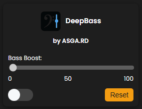

# DeepBass

DeepBass is a browser extension that allows you to enhance the bass while listening to music on any website, improving your audio experience.

## Overview

It's perfect for music lovers who want to enjoy deeper and richer sound while streaming their favorite tracks. With DeepBass, you can quickly adjust the bass levels to suit your preferences.

## Features

- **Bass Boost Slider**: Easily adjust the bass level for any audio source.
- **Toggle Functionality**: Enable or disable the bass boost with a simple switch.
- **User -Friendly Interface**: Simple and intuitive design for easy navigation.
- **No Ads or Tracking**: Enjoy a clean experience without interruptions.

## Why DeepBass?

Sometimes the audio can lack depth, especially on certain platforms. DeepBass provides a quick and effective way to enhance your listening experience without altering your device's audio settings. It's designed to make your music sound better.

## Status

- **Current Version**: 1.0
- **Development Status**: Work in progress! We are continuously working on improving the extension and adding new features.

## Team

- Your Name [@yourusername](https://github.com/yourusername)
- Collaborator Name [@collaboratorusername](https://github.com/collaboratorusername)

> ## License
>
> DeepBass is free to use as a browser extension.
>
> However, the source code is published for **viewing only**.
> **Copying, modifying, or reusing the code in any way is not allowed without written permission**.
>
> See the [LICENSE](LICENSE) file for more details.
